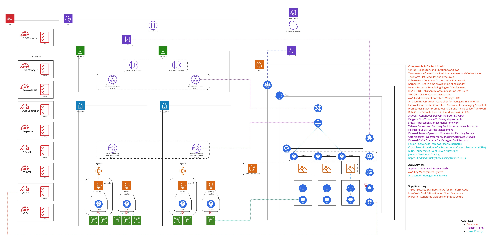

# aws-sandbox


   <br>
     


<br>

## **Project Summary**:
This repository serves as an example project where you can experiment with different "stacks" using Terramate following generally good design practices.

<br><br>

### Diagram of what we are building


<br><br>


### **Summarized list of Technologies/Tools:**
<br>

&nbsp;&nbsp;&nbsp; CI Pipeline Related:
* Github Actions
* AquaSec TFsec
* Infracost

&nbsp;&nbsp;&nbsp; Infra-as-Code and Orchrestation Related:
* Terraform
* Terraform Cloud
* Terramate
* Pluralith

&nbsp;&nbsp;&nbsp; Kubernetes Related:
* ContainerD
* Helm
* Karpenter
* IRSA using OIDC
* AWS Load Balancer Controller
* VPC CNI
* Amazon EBS CSI Driver
* External Snapshotter Controller
* Prometheus Operator Stack
* KubeCost

&nbsp;&nbsp;&nbsp; AWS Services:
* VPC
* NAT Instance Gateways
* Identity and Access Management
* EKS - Managed Kubernetes Service
* EC2 Instances
* Launch Templates
* Autoscaling Groups
* Elastic Load Balancers
* KMS - Key Management Service


<br><br><br>

#### **Project Notes:**
<br>

&nbsp;&nbsp;&nbsp; Some of the documented components/services have yet to be added.
  * Therefore they will be missing until they are added to the project.

<br>

&nbsp;&nbsp;&nbsp; When provisiong the "dev" stack (`stacks/dev`) by default it's set to "remote" (Terraform Cloud) for backend state storage.
  * You will need to modify the `tfe_organization` global variable in the `stakcs/config.tm.hcl` file with your Otganization ID.
  * You can also easily opt to use the "local" backend storage by setting the global variable `isLocal` to `true` in the `stacks/dev/config.tm.hcl` file.

<br>

&nbsp;&nbsp;&nbsp; We might recommend using a sandbox or trial account (ie. A Cloud Guru Playground) account when initially using the project.
  * Protects users from accidently causing any risk/issues with existing environment configurations.
  * Can also prevent any naming colisions during provisioning with existing resources.

<br>

&nbsp;&nbsp;&nbsp; There are a lot of opportunies for optimizing the configuration management for this project. (This was intentional!)
  * This project was intended for testing purposes of sample Infra Code, which is used to illustrate how you might structure your project.

<br>

&nbsp;&nbsp;&nbsp; Those running an ARM CPU architecture (ie. Apple's M1) might find it challenging when trying to use the project.
  * This is due to lack of current support of compiled binaries for ARM and lack of native emulation (Rosetta 2 in OSX (until OSX-13 Ventura).

<br><br><br>


## **Project Walkthrough**:
<br>

### Binary Prerequisites:
<br>

&nbsp;&nbsp;&nbsp; **Required for Method 1**
* aws-cli (v2.7) 
* terramate (v0.1.35+)
* terraform (v1.2.9+)
* kubectl (v1.19+)

<br>

&nbsp;&nbsp;&nbsp; **Required for Method 2**
* docker [v20.10+]

<br><br><br>


### ***Choice of Provisioning Methods***
<ol>
  <li> Method 1: Running from your local system (tested on OSX 10.15 Catalina)
  <li> Method 2: Running within a custom Docker image: Easier 
</ol>

<br><br>

### Common Configurations (necessary for eihter method)
<br>

#### Set your AWS variables on your local system
```
export AWS_DEFAULT_REGION='us-west-2'
export AWS_ACCESS_KEY_ID='<PASTE_YOUR_ACCESS_KEY_ID_HERE>'
export AWS_SECRET_ACCESS_KEY='<PASTE_YOUR_SECRET_ACCESS_KEY_HERE>'
```
<br><br><br>

### Provisioning Method 1: Running from your local system
<br>

#### Generate Terraform code and Provision the Terramate Stacks
```
# Terramate Generate
terramate generate
git add -A


# Terraform Provisioning
terramate run -- terraform init
terramate run -- terraform apply
```
<br>


#### EKS Cluster Configuration:
```
# Add EKS Cluster Configure/Creds
aws eks update-kubeconfig --name ex-eks

# Edit Kube Config to Connect to cluster (Add to the bottom of the "Users" section of the config...) 
cat <<EOT >> ~/.kube/config
      env:
      - name: AWS_ACCESS_KEY_ID
        value: ${AWS_ACCESS_KEY_ID}
      - name: AWS_SECRET_ACCESS_KEY
        value: ${AWS_SECRET_ACCESS_KEY}
EOT
```
<br><br><br>


### Provisioning Method 2: Running within a built Docker container
<br>

#### Build Image and Start Container
```
make build && make start
```


#### Exec into Docker Container Shell
```
make exec
```


#### Generate Terraform code and Provision the Terramate Stacks
```
# Source Script Functions
source functions.sh

# Change Directory into "Local" Stack
cd /project/stacks/local

# Terramate Commands (Generate/Validate/Apply)
tm-apply
```


#### Configures Kubernetes CLI (Config/Credentials)
```
eks-creds
```


<br><br><br>

### Check for Deprecated/Removal of Resources in using Fairwinds Pluto
```
pluto detect-helm -o wide -t k8s=v1.25.0
pluto detect-api-resources -o wide -t k8s=v1.25.0
```


<br><br><br>

### Karpenter Testing:

#### Scale the Deployment causing Karpenter to Add/Scale-Up Nodes
```
kubectl scale deployment inflate --replicas 2
```

#### Scale the Deployment causing Karpenter to Removes/Scale-Down Nodes 
```
kubectl scale deployment inflate --replicas 0
```


<br><br><br>

### Karpenter Testing:

#### Run Infracost and Pluralith
```
# InfraCost (Requires an Account)
export INFRACOST_API_KEY="<INFRACOST_API_KEY_HERE>"
export INFRACOST_ENABLE_DASHBOARD=true
terramate run -- infracost breakdown --path . --usage-file ./infracost-usage.yml --sync-usage-file

# Set Pluralith Credentials (Requires an Account)
export PATH=$PATH:/root/.linuxbrew/Cellar/infracost/0.10.13/bin
export PLURALITH_API_KEY="<PLURALITH_API_KEY_HERE>"
export PLURALITH_PROJECT_ID="<PLURALITH_PROJECT_ID_HERE>"

# Run Pluralith Plan
terramate run -- pluralith init --api-key $PLURALITH_API_KEY --project-id $PLURALITH_PROJECT_ID
terramate run -- pluralith run plan --title "Stack" --show-changes=false --show-costs=true ----cost-usage-file=infracost-usage.yml
```


<br><br><br>

### Destroy Provisioned Infrastructure:
```
terramate run --reverse -- terraform destroy
```